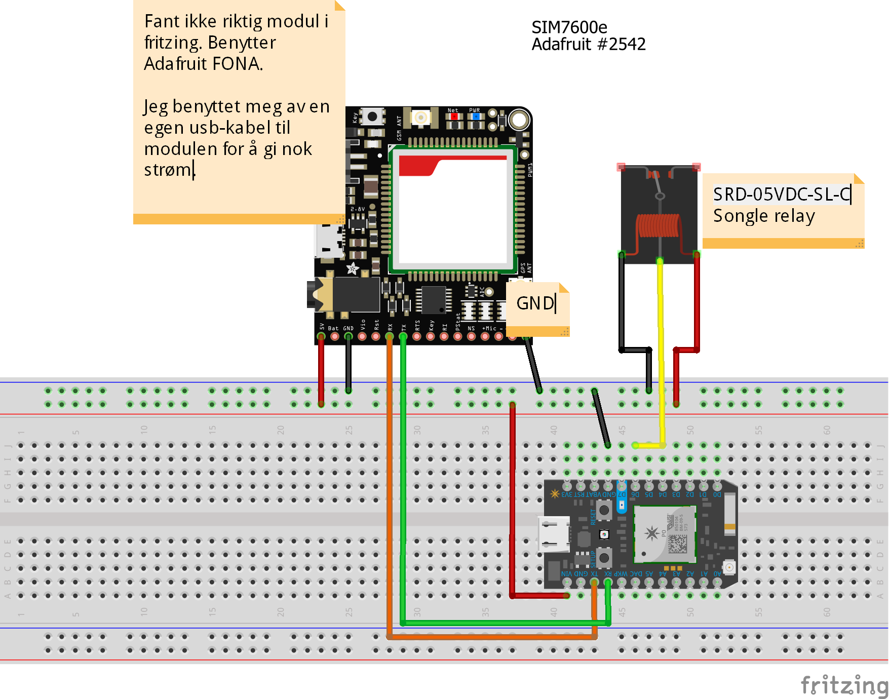

## BoatShare - m2m eksamen 2020

### Introduksjon

Ved å besøke nettsiden www.istre.io vil brukeren kunne se hvor det befinner seg båter som er tilgjengelig for leie
i tillegg til å låse opp/låse båten de ønsker å leie.

Slik løsningen er nå så trengs det ingen innlogging før man kommer inn på siden. Landingssiden i dagens løsning er 
derfor slik en innloget side ville sett ut i en reel situasjon.

Dagens løsning gjør det veldig enkelt å legge til flere devices og lagre data om disse. 
Utover kapasiteten til selve serveren kan det i teorien legges til ubegrenset antall devices.
Siden det for øyeblikket ikke er noen sjekk om particle photonen er registrert i systemet må man kun 
"flashe" kildekoden rett på en particle photon og koble opp slik som det er vist lengre ned.
Den vil deretter dukke opp i løsningen så fort gps-signal er funnet

### 1.0 Particle Photon

Som standard ligger det en bredde og lengdegrad i Oslo inne i kildekoden.
Dette er kun for å vise at det fungerer selv om man ikke har oppnådd kontakt med noen satelitter da dette krever at man går ut.
Med en gang en "ekte" posisjon er oppnådd vil denne ta over for dummy-posisjonen
Jeg hadde et ønske om å lagre siste kjente posisjon til EEPROM på photonen, men dette har jeg dessverre ikke fått til enda.


Alle klasser og metoder er dokumentert ved hjelp av doxygen og alt ligger vedlagt.
Se index.html filen som ligger i /boat_share/Particle/src/html

#### 1.1 Sim 7600e lte/gps modul
Benyttes for å oppnå kontakt med omverden ved hjelp av 4g i tillegg til å muliggjøre sporing av båten

#### 1.2 Songle relay - SRD-05VDC-SL-C
Relé for å kunne åpne og lukke låsen som er koblet til løsningen


-------------------


### 2.0 Backend
Hele backend-løsningen er hostet ved hjelp av en digital ocean droplet. 
Her kjører Nginx som lar oss sende statiske filer til de som kobler seg opp på ip addressen/domenet(istre.io) til
dropleten. Disse statiske dokumentene ligger i dette tilfellet i react appen sin build mappe som opprettes når vi kjører følgende kommando i rotmappen av prosjektet
```
npm run build
```

#### 2.1 Hosting av løsningen på DigitalOcean 
Valget om å benytte meg av DigitalOcean ble tatt da jeg så hvor raskt og enkelt man kunne få en ubuntu server opp og gå til en relativt billig penge.

##### 2.1.1 Droplet 
Siden digital ocean enkelt og billig lar meg opprette en server har jeg valgt å opprette en droplet som kjører Ubuntu 20.04 (LTS) x64 hos dem

##### 2.1.2 Nginx
Nginx er et server-verktøy som gjør det mulig styre trafikken som kommer inn på serveren basert på stien som er spesifisert i url'en.
Når en klient kobler seg opp sender nginx de statiske dokumentene tilbake. 

En annen viktig grunn til at jeg tok i bruk Nginx var mulighet til å gjøre såkalt "reverse-proxy" som vil si at backend løsningen(nodejs) kan lytte på localhost:9000 og vi slipper dermed å la apiet til backend 
ligge å lytte ut på den offentlige ip-addressen til serveren. Når en spørring fra frontend gjøres sendes dette til nginx serveren som lytter på den offentlige ip-addressen til serveren. 
Deretter sender nginx api-kallet videre inn på serveren, men nå blir api-kallets url endret til localhost og nodejs serveren blir dermed klar over at frontend har sendt en forespørsel.(Tagliaferri & Juell 2020)

##### 2.1.3 Lets encrypt og Certbot for https trafikk mellom klient og tjener
Serveren er satt opp med https-kryptering og dette er gjort ved hjelp av Certbot som enkelt oppretter og henter ssl sertifikater fra Lets encrypt sin tjeneste.(Brian 2020) 

#### 2.2 CloudMQTT.com
Løsningen benytter seg av CloudMQTT som mqtt-broker.
For benytte denne trenger mqtt klientene bruker navn og passord.
Disse opplysningen ligger lagret i kildekoden til particle photon /boat_share/Particle/src/MqttClient.cpp

#### 2.3 API ved hjelp av NodeJS
APIet i løsningen er opprettet ved hjelp av Nodejs. Årsaken til dette  valget er at jeg har litt erfaring med dette fra tidligere og visste at jeg raskt kunne sette opp en 
tilfredsstillende løsning for et API. Følgende bibliotek har gjort det mulig å kommunisere med klient og particle photon i tillegg til å lagre data mellom hver sesjon.

##### 2.3.1 Expressjs (Express 2020)
Nodejs bibliotek for å opprette en webserver og håndtere forespørsler fra/til klient.
Her håndteres alle GET og POST request som går mellom klient og tjener. I dette tilfellet vil dette være 
informasjon om posisjonene til de ulike båtene og om en klient har forespurt åpning/lukking av en av disse. 

##### 2.3.2 Socket.io (Socket.io 2020)
Jeg forsøkte først å benytte meg av såkalte SSE(Server Sent Events), men det viste seg at ubuntu sin brannmur stoppe dette ganske raskt.
For å kunne gi brukerne live data når de besøker tjenesten måtte jeg derfor sette opp websockets som kunne strømme data live fra serveren.
Det endte med at jeg tok i bruk Socket.io som viste seg å være veldig raskt og enkelt å få opp. 
Hver gang en klient kobler seg opp mot tjeneren opprettes de nødvendige websocketene slik at de får live posisjonsdata for alle båtene som er koblet opp mot løsningen.


##### 2.3.3 mqtt.js (mqtt.js 2020)
Kommunikasjon med cloudMqtt gjøres med mqtt.js biblioteket. 
Hver gang en bruker trykker på knappen for å låse/låse opp en båt sendes det en mqtt melding til cloudmqtt.
Hver device har sitt eget topic /openDevice/[id] og /clientStatus/[id] som serveren lytter til på det overordnede emnet. 
Eksmpler på data som sendes fra serveren til klienten er:

```
/openDevice/38002b000447373336323230	message: 1 //Dette gir photon med id 38002b000447373336323230 beskjed om å aktivere releet og åpne låsen
/openDevice/38002b000447373336323230	message: 0 //Motsatt av meldingen over
```
Eksempler på meldinger fra photonen:
```
topic: /connected/	message:38002b000447373336323230 //sendes når photonen har bootet opp. Benyttes ikke av nodejs serveren for øyeblikket
topic: /clientStatus	message: {"id":"38002b000447373336323230","lat":"59.923420", "lng":"10.770557","connectionStatus":"online"} // sendes med jevne mellomrom for å gi status om posisjon til serveren
topic: /deviceStatus/38002b000447373336323230	message: open // Viser at låsen er åpen. //benyttes kun til debuging for øyeblikket
topic: /deviceStatus/38002b000447373336323230	message: closed // Viser at låsen er åpen. //benyttes kun til debuging for øyeblikket
topic: /clientStatus	message: sattelites not found for device: 38002b000447373336323230 //benyttes kun til debuging for øyeblikket
```
Denne meldingen sendes med retain flagget slik at particle photonen alltid vil få beskjed om den siste meldingen som ble sendt
uavhenging om den var online på det tidspunktet meldingen ble sendt.


Ved boot sender også photonen informason om seg selv til mqtt serveren. Dette leses av nodejs serveren som derretter oppdaterer dataene i databasen. 
I tillegg har jeg forsøkt å legge opp last will melding for photonen, men det virker ikke som cloudmqtt lar meg gjøre dette.
Dette er en melding som skal sendes hvis photonen kobler fra mqtt serveren på feil måte.
I dette tilfellet blir det sendt informasjon fdra mqtt serveren til nodejs servere om at photonen her offline.

##### 2.3.4 Mongoose og lagring av data
For å kunne lagre data om båtene mellom hver oppdatering og ved eventuell nedetid på serveren trengte jeg noe som kunne lagre data mellom hver økt.
Det endte med Mongoose da dette biblioteket enkelt lar nodejs serveren koble seg opp mot en MongoDB database. 
Siden MongoDB baserer seg på json gjør det databehandling med mqtt-meldingene veldig rask og enkel. 

Data som lagres i dag er følgende:
- **id**: unik id som er particle photon sin unike id.
- **lat**: latitude - for å kunne vise posisjonen til båten
- **lng**: longitude - for å kunne vise posisjonen til båten
- **connectionStatus**: status for tilkobling mellom server og båten. (online/offline). Benyttes til å gi beskjed at båten ikke kan låses opp
- **owner**: Eier av båten
- **currentUser**: bruker som leier båten akkurat nå
- **rentable**: Om båten er mulig å leie
- **lastupdated**:Sist oppdatert via mqtt - i dagens løsninge viser denne kun sist data oppdatert eller hentet ut og har derfor ingen verdi i dagens løsning.

Andre data som kunne vært lagret er: 
- flere opplysninger om brukere og eiere. Dette måtte vært i egne tabeller i databasen
- Historikk på hvem som har leid hvilke båter for å kunne gå tilbake for å sjekke hvem som f.eks påførte eventuelle skader

------

### 3.0 Frontend - React
For å kunne vise data til sluttbruker har jeg bnyttet React for å lage en enkel frontend som gir brukeren mulighet 
til å se hvor de ulike båtene befinner seg i tillegg til å kunne reservere/låse opp en båt. 
Løsningen er responsiv som dermed gjør det enkelt for brukere på både mobil og desktop.

#### 3.1 Bibliotek
##### 3.1.1 Google maps
Landingssiden for løsningen viser et kart over hvor de ulike båtene befinner seg. Dette kartet 
er laget ved hjelp av google-map-react for å tegne kart og markørene på kartet.
Markørene er egne komponenter som inneholder info om koordinater, id og om båten er pålogget.
Hvis båten ikke er pålogget forsvinner båten fra kartet og kan dermed ikke leies lenger.
(google-map-react 2020)

##### 3.1.2 Socket.io
Samme som i backend, bare her benyttes en lytter for å lytte etter dataene som sendes via websockets til frontend.
(Socket.io frontend 2020)

#### 3.2 React Komponenter

######3.2.1 Map
Hovedkomponenten i løsningen. Denne laster inn kartet og alle markørene som viser hvor de ulike båtene som er koblet opp mot løsningen befinner seg

##### 3.2.2 Marker
Komponent for markørene som vises i Map komponenten.
Benytter seg av posisjonsdata sendt fra serveren til å tegne seg selv opp inne i kart komponenten.

##### 3.2.2 Infowindow
Komponent for vinduet som dukker opp når brukeren klikker på en av markørene. 
Inneholder data om id, posisjon og en knap som lar brukeren reservere en båt.
(google-map-react-examples 2020)

##### 3.2.2 Burger
Komponent for burgermeny ikonet oppe i venstre hjørnet av løsningen.(burger menu 2020)

##### 3.2.3 Menu
Komponent for menyen som kommer til syne når brukeren klikker på burgerikonet. (burger menu 2020)

-------

### 4.0 Videreutvikling og hva som kunne vært gjort annerledes

#### 4.1 Valg av hardware
Løsningen bnytter ikke noe hardware utover det som er nødvendig for kunne gjennomføre den oppgaven som tingen skal gjøre, å spore og åpne/låse en båt. 
Jeg gikk tidlig inn for å benytte meg av particle photon da denne gir meg muligheten til å oppdatere firmware over internet.

### 5.0 Oppsett og viktig informasjon
Webserveren med nginx er ikke nødvendig for å teste løsningen

#### 5.1 Forutsetninger
- Prosjektet kjører på **Windows 10** og **Ubuntu 20.04** (LTS) x64_id. OSX er ikke testet

-  Installere siste versjon av **nodejs** og **npm** https://nodejs.org/en/download/
	- Etter installasjon er fullført se til at både nodejs og npm er installert ved å kjøre følgene i terminalen:
```	
node -v
npm -v
```
- Installer **MongoDB**. Last ned siste versjon for ditt operativsystem og installer
    - Windows: https://www.mongodb.com/try/download/community?tck=docs_server
    - Ubuntu: https://docs.mongodb.com/manual/tutorial/install-mongodb-on-ubuntu/
 - Default så opprettes en database på **localhost:27017** det er denne nodejs benytter for å kontakte databasen.
 - dobbeltsjekk at **mongodb** er installer ved å kjøre ```mongod --version```
 - Hvis dette ikke gir resultat:
    - **Windows**:  sjekk om mongodb mappen finnes under :  "C:\Program Files"
        - Hvis mappen er her legg til dette i PATH: "C:\Program Files\MongoDB\Server\4.4\bin"
    - **Ubuntu**: Sjekk om mongod filen ligger under /bin/. Hvis det fortsatt oppstår problemer følg denne for deretter å reinstallere:https://docs.mongodb.com/manual/tutorial/install-mongodb-on-ubuntu/#uninstall-mongodb-community-edition
  


#### 5.2 Installasjon av løsningen
 
3. Pakk ut boat_share zipfilen på ønsket sted
    - se til at det ligger en .env fil inn under /boat_share/ og en under  /boat_share/boat_share_backend. Disse skal inneholder følgende:
    - /boat_share/.env:
    ```
   REACT_APP_API_URL=http://localhost:9000
   REACT_APP_SOCKET_URL=http://localhost:9000
   REACT_APP_GOOGLE_API=[INPUT GOOGLE API KEY]
   REACT_APP_BACKEND_API=
   ```
    - /boat_share/boat_share_backend/.env
    ```
   frontend_HOST=localhost
   frontend_PORT=3000
   ```
    
4. Gå til rotmappen i prosjektet /boat_share/ og kjør:
```npm install```
5. Gå videre til mappen /boat_share/boat_share_backend og kjør:
```npm install```
6. Bli i /boat_share/boat_share_backend mappen og kjør:
```npm start``` 
7. Gå tilbake til mappen /boat_share/ og kjør:
```npm start``` 
8. Løsningen kjører nå på localhost:3000


##### Fritzing



-----

#### Kilder

##### Metoder og  fremgangsmåter benyttet til Particle photon

- Oppsett av sim7600 module for particle photon- https://gist.github.com/jenschr/2d248362a4c3c5651145b5f009586513
- Send and read response - https://gist.github.com/jenschr/2d248362a4c3c5651145b5f009586513
- SendAtCommand - https://gist.github.com/IdrisCytron/7ed2defe995cec8109efc5561fb00886
- intialize GPS - https://m2msupport.net/m2msupport/atcgps-start-stop-gps-session/
- GPS positioning - https://gist.github.com/IdrisCytron/7ed2defe995cec8109efc5561fb00886
- dokumentasjon sim7600 - http://www.thebackshed.com/forum/uploads/Grogster/2018-07-24_122343_BK-SIM7600_Board_user_manual_V1.0.pdf
- dokumentasjon sim7600 AT commands - https://simcom.ee/documents/SIM7600C/SIM7500_SIM7600%20Series_AT%20Command%20Manual_V1.01.pdf
- dokumentasjon sim7600 mqtt - https://simcom.ee/documents/SIM7X00/SIM7500_SIM7600_SIM7800%20Series_MQTT_AT%20Command%20Manual_V1.00.pdf


##### Backend
 - Boucheron, Brian  2020. "How To Secure Nginx with Let's Encrypt on Ubuntu 20.04" Hentet 10. nov 2020. https://www.digitalocean.com/community/tutorials/how-to-secure-nginx-with-let-s-encrypt-on-ubuntu-20-04
 - Lisa Tagliaferri &  Kathleen Juell  2020. "How To Set Up a Node.js Application for Production on Ubuntu 20.04" Hentet 30. okt 2020 https://www.digitalocean.com/community/tutorials/how-to-set-up-a-node-js-application-for-production-on-ubuntu-20-04
 - Express 2020. Hentet 25. nov 2020. https://expressjs.com/en/4x/api.html
 - mqtt.js 2020. Hentet 25. nov 2020. https://www.npmjs.com/package/mqtt#api
 - Socket.io 2020. Hentet 25. nov 2020. https://socket.io/docs/v3/server-api/
 - mongoose 2020. hentet 25 nov. 2020. https://mongoosejs.com/docs/api/model.html#model_Model.update
 
##### Front end
 - Socket.io frontend 2020. Hentet 25 nov 2020. https://socket.io/docs/v3/client-api/index.html
 - google-map-react 2020. Hentet 25. nov 2020. https://github.com/google-map-react/google-map-react
 - google-map-react-examples 2020. Hentet 25. nov 2020. https://github.com/google-map-react/google-map-react-examples/blob/master/src/examples/MarkerInfoWindowGmapsObj.js
 - burger menu 2020. Hentet 25.nov 2020. https://github.com/maximakymenko/react-burger-menu-article-app
------
